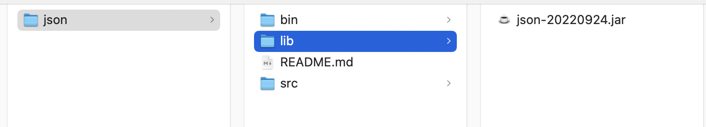

= Json in Java

모듈을 사용하기 위해서는 여러 저장소들에서 제공되는 다양한 모듈중 용도와 사용법들이 가장 적합하다 판단되는 모듈을 내려 받아 사용하다.

각각의 모듈들은 json 구성을 위한 다양한 기능을 제공하고는 있지만, 모듈에 따라 사용법이나 표기법에서 차이가 있을 수 있다.

{empty} +

== 내려 받기

자바에서 사용 가능한 json 모듈은 다양하게 제공되고 있다.

**Maven Repository**

메이븐 저장소는 메이 빌드 도구 뿐만 아니라 다양한 빌드 도구를 사용할때, 설정된 모듈을 받을 수 있는 저장소이다. 

메이븐 저장소에서 json을 검색하면 아래와 같이 다양한 모듈을 찾을 수 있다.

image::./image/json_search_in_maven_repository.png[align=center,width=600]

이중에서 가장 기본에되는 JSON in Java 모듈을 선택한다.

JSON in Java를 선택해 들어가면, 해당 모듈과 관련된 다양한 정보가 표시되며, 버전 정보도 확인 가능하다.

가장 최신 버전인 20220924를 받아 보도록 하자. 버전 20220924를 선택한다.

20220924 버전 정보 페이지에서 Files > bundle를 클릭하여 모듈을 내려 받는다.

== 모듈 설치

내려 받은 모듈(json-20220924.jar)를 프로젝트의 라이브러리 디렉토리에 복사한다.

=== 모듈 구성

json모듈에서 지원하는 클래스들의 계층 구조는 아래와 같다.

[source,mermaid]
---
classDiagram
  Object <|-- CDL
  Object <|-- Cookie
  Object <|-- CookieList
  Object <|-- HTTP
  Object <|-- JSONArray
  Object <|-- JSONML
  Object <|-- JSONObject
  Object <|-- JSONPointer
  Object <|-- JSONString
  Object <|-- JSONTokener
  Object <|-- JSONWriter
	JSONObject
	JSONString
	JSONTokener <|-- HTTPTokener
	JSONTokener <|-- XMLTokener
	JSONWriter <|-- JSONStringer
	Throwable <|-- Exception
	Exception <|-- RuntimeException
	RuntimeException <|-- JSONException
	JSONException <|-- JSONPointerException
---

[cols="1,4"]
|===
^s|Class
^s|설명

^s| CDL
| 쉼표(**,**)로 구분된 문자열을 JSONArray로 변환하고나 JSONArray를 쉼표로 구분되는 문자열로 변환

^s| Cookie
| 웹 브라우저 쿠키 규격을 JSONObject로 변환하거나 JSONObject를 쿠키 규격으로 변환한다.  JSON과 Cookie는 둘 다 이름/값 쌍의 표기를 사용한다.

^s|CookieList
| 웹 브라우저 쿠키 목록 문자열을 JSONObject로 변환하거나 JSONObject를 쿠키 목록 문자열로 변환한다.

^s|HTTP
|HTTP 헤더를 JSONObject로 변환하거나 JSONObject를 HTTP 헤더로 변환한다.

^s|JSONArray
| 요소들이 순서대로 배열된 값이다.

^s|JSONML
|XML 텍스트를 JSONArray 또는 JSONObject로 변환하거나 SONArray 또는 JSONObject를 XML 텍스트로 암호화한다.

^s|JSONObject
|이름/값 쌍의 정렬되지 않은 모둠이다.

^s|JSONPointer
|[RFC 6901](https://datatracker.ietf.org/doc/html/rfc6901)에 의해 JSON 문서에 대해 정의된 간단한 쿼리 언어이다.

^s|JSONPointer.Builder
|사용자가 각 단계에서 정확히 하나의 세그먼트를 사용하여 단계별로 JSONPointer를 작성할 수 있도록 한다.

^s|JSONString
|?? 

^s|JSONTokener
|문자열을 가져와 문자 및 토큰을 추출한다.

^s|HTTPTokener
|JSONTokener를 확장하여 HTTP 헤더의 구문 분석을 위한 추가 방법을 제공한다.

^s|XMLTokener
|JSONTokener를 확장하여 XML 텍스트의 구문 분석을 위한 추가 method를 제공한다.

^s|JSONWriter
|JSON 텍스트를 빠르고 편리하게 생성할 수 있는 방법을 제공한다.

^s|JSONStringer
|JSON 텍스트를 빠르고 편리하게 생성할 수 있는 방법을 제공한다.

^s|JSONException
|상황이 잘못될 때 JSON.org 클래스에 의해 던져진다.

^s|JSONPointerException
|JSON Pointer포인터를 평가하는 동안 오류가 발생하면 JSONPointer가 예외를 발생시킨다

^s|Property
|속성 파일 데이터를 JSONObject로 변환하거나, JSONObject를 속성 파일 데이터로 변환한다.

^s|XML
|XML 문자열을 JSONObject로 변환하거나 JSONObject를 XML 문자열로 변환한다.
|===

{empty} +

== Class JSONObject

JSON 구성 요소에서 object를 모델링한다.

[source,java]
----
public class JSONObject extends Object
----

* 이름/값 쌍의 정렬되지 않은 컬렉션(자바의 컬렉션 프레임웍은 아님)이다.

* 외부 형식은 이름과 값 사이에 콜론이 있고 값과 이름 사이에 쉼표(**,**)가 있는 중괄호(**{** **}**)로 묶인 문자열이다.

* 내부 형식은 이름으로 값에 접긴하기 위한 get 및 opt method, 이름으로 값을 추가하거나 바꾸기 위한 put method를 가진 개체이다

* 값은 다음 유형 중 하나일 수 있다.

  * boolean
  * JSONArray
  * JSONObject
  * Number
  * String
  * JSONObject.NULL

{empty} +

=== Constructor

JSONObject constructor는 외부 형식인 JSON 문자열을 get 및 opt method를 사용하여 값을 검색할 수 있는 내부 형식으로 변환하거나 put 및 toString method를 사용하여 값을 JSON 문자열로 변환하는 데 사용할 수 있다.

{empty} +

지원되는 constructor는 아래와 같다.

[cols="2,3"]
|===
^|*Constructor*
^|*설명*

|*JSONObject()*
|이름/값이 설정되지 않은 기본 constructor

|*JSONObject(int initialCapacity)*
|주어진 크기의 이름/값을 저장할 내부 자원 확보 constructor

|*JSONObject(JSONObject jo, String... names)*
|다른 JSONObject에서 나열된 이름만 추측하여 설정하는 constructor

|*JSONObject(JSONTokener x)*
|JSONTokener로부터 이름/값을 받아 설정하는 constructor

|*JSONObject(Map<?,?> m)*
|자료구조 Map을 받아 설정하는 constructor

|*JSONObject(Object bean)*
a|
----
자바 Object의 getter들을 이용해 설정하는 constructor
POJO를 이용해 설정하는 constructor
----

|*JSONObject(Object object, String... names)*
|자바 Object에서 reflection을 이용해 특정 멤버만 찾아 설정하는 constructor.

|*JSONObject(String source)*
|JSON 텍스트에서 변환해 설정하는 constructor

|*JSONObject(String baseName, Locale locale)*
|ResourceBundle.* 에서 이름/값을 찾아 설정하는 constructor
|===
    
link:example/exam-01.adoc[Exam-01. 기본 constructor를 이용해 JSON object를 생성하고 설정해 보자]

link:quiz/quiz-01.adoc[Quiz-01. Exam-01을 참고하여 아래와 같은 결과가 출력되도록 수정하라]

{empty} + 

=== JSON 문자열

JSON object를 이종 시스템간 주고 받거나 파일을 이용해 저장할 경우, 문자열 형태로 많이 사용한다.

문자열로 JSON object를 표현하면 아래와 같다.

[source,text]
----
"{\"name\" : \"nhn\"}"
----

JSONObject class의 constructor는 다양한 인수를 받을 수 있도록 정의되어 있다.

이중에는 JSON 문자열을 받아서 object를 생성하는 constructor도 있다.

[source,java]
----
JSONObject(String source)
----

예제를 이용해 JSON 문자열을 이용해 JSON object를 만드는 방법을 보자.

link:example/exam-02.adoc[Exam-02. Constructor중에서 JSON 문자열을 인수로 받아 JSON object를 생성해 보자]

link:quiz/quiz-02.adoc[Quiz-02. JSON 문자열을 이용하여 JSON object를 생성하라]

{empty} +

=== Object를 이용하여 구성하기

JSONObject의 constructor는 Object를 인수로 받아서 JSON object를 구성할 수 있다.

Object를 이용해 구성하는 간단한 예를 보자.

link:example/exam-03.adoc[Exam-03. Java object를 이용해 JSON object를 생성하라]

link:quiz/quiz-03.adoc[Quiz-03. Person class를 수정하여 더 많은 정보를 추가하라]

{empty} +

=== 값 변경하기

JSONObject class의 put은 object의 값을 추가하거나 바꿀 수 있다.

앞 예제 Exam-01에서 put을 이용해 새로운 name/value 추가를 적용해 보았다.

[source,java]
----
include::../src/main/java/example/Exam01.java[lines=11..12,indent=0]
----

위 코드는 JSONObject를 생성하고, put을 통해 값을 설정한다.

put은 주어진 name의 value가 없을 경우 추가하지만, 이미 추가되어 있는 name이라면 value를 변경한다.

link:../example/exam-04.adoc[Exam-04. JSON object의 값을 변경해 보자]

link:../quiz/quiz-04.adoc[Quiz-04. JSON object의 값을 변경하라]

{empty} +

=== 값 가져오기

* get method는 value을 찾을 수 있으면 반환하고 찾을 수 없으면 예외를 반환한다. 
** JSONObject에 있는 요소들 중 해당 이름의 요소를 가져온다.
** value type을 알고 있는 경우, 해당 타입으로 반환 받을 수 있다.

{empty} +

==== Value type 미지정

* 반환되는 타입은 Object 타입으로 사용자의 직접적인 변환이 요구된다.
* get(String key)

link:example/exam-05.adoc[Exam-05. JSON object의 value를 찾아 반환되는 object의 type을 확인해 보자]

{empty} +

==== Value type 지정

* 요청시 반환 타입에 맞는 method를 호출하고, 요구 타입으로 반환이 어려울 경우 exception을 발생시킨다.
* getInt(String key),  getJSONArray(String key), getJSONObject(String key), ...
* 배열에서 특정 위치의 요소를 가져오는 것은 get과 동일하지만, 반환 되는 타입이 지정있다.

link:example/exam-06.adoc[Exam-06. JSON object의 value를 찾아 지정된 data type으로 요청해 확인해 보자]

link:example/exam-07.adoc[Exam-07. JSON object의 value type을 잘못 지정한 경우 처리방법에 대해 알아 보자]

{empty} +

==== Default value를 이용한 value 처리
* opt method는 예외를 던지는 대신 기본값을 반환하므로 선택적 값을 가져오는 데 유용하다.

link:quiz/quiz-05.adoc[Quiz-05. 구성원 정보를 JSON에서 가져와 확인하려 한다. 코드를 완성하라]

{empty} + 

== Class JSONArray

[source,java]
----
public class JSONArray extends Object implements Iterable<Object>
----

* JSONArray는 요소들이 순서대로 배열된 **값**이다.  
* 외부 텍스트 양식은 쉼표가 있는 대괄호(**[** **]**)로 묶인 문자열로 요소들을 구분한다. 
* 내부 형식은 인덱스로 값에 접근하는 get 및 opt method, 값을 추가하거나 바꾸기 위한 put method를 포함한다. 
* 요소들은 다음 유형 중 하나일 수 있다. 
** boolean
** JSONArray
** JSONObject
** Number
** String
** JSONObject.NULL

constructor는 JSON 텍스트를 Java object로 변환할 수 있다. toString method는 JSON 텍스트로 변환된다.

get method는 값을 찾을 수 있으면 반환하고 찾을 수 없으면 예외를 반환한다. 

opt method는 예외를 던지는 대신 기본값을 반환하므로 선택적 값을 가져오는 데 유용하다.

=== Constructor

JSONArray는 아래와 같은 다양한 constructor를 지원한다. 자바에서 사용될 수 있는 다양한 요소들의 집합(?)들을 가져와 생성할 수 있고, 추가적인 요소들은 메소드를 통해 포함시킬 수 있다.

[cols="1,2"]
|===
s|JSONArray()
|요소가 없는 JSONArray 생성

s|JSONArray(Collection<?> collection)
|컬렉션에서 요소를 참조하여 JSONArray object 생성

s|JSONArray(int initialCapacity)
|초기 배열 크기를 지정하여 JSONArray object 생성

s|JSONArray(Iterable<?> iter)
|Iterable object에서 요소를 참조하여 JSONArray object 생성

s|JSONArray(JSONArray array)
|JSONArray에서 요소를 참조하는 복제

s|JSONArray(JSONTokener x)
|JSONTokener에서 요소를 받아 JSONArray object 생성

s|JSONArray(Object array)
|요소들의 배열을 자바 Array object로 받아 JSONArray object 생성

s|JSONArray(String source)**
|JSON 문자열을 받아 가공하여 처리하여 적용
|===    

여러가지로 제공되는 constructor중 간단하게 요소의 배열을 JSONArray로 만드는 과정을 보자.

아래와 같이 JSONArray constructor의 인자로서 요소의 배열을 주면 해당 요소들로 구성된 JSON 배열이 생성된다.

[source,java]
----
JSONArray jsonArray = new JSONArray(new int[align=center,width=600]{1,2,3});
----

link:quiz/quiz-06.adoc[Quiz-06. 주어진 형태의 JSONObject를 생성하라]

=== 요소 추가하기

JSONArray를 이용해 배열을 구성하는 방법 중 기본 constructor를 이용해 object를 생성한 후 개별 값을 추가하는 방법이 있다. 

이는 JSONArray의 메소드 중 put을 이용하여 배열 구성 요소들을 추가하는 방법으로 아래와 같이 호출한다.

[source,java]
----
int [] items = new int[]{1,2,3};
JSONArray jsonArray = new JSONArray();

for(int item : items) {
  jsonArray.put(item);
}
----

실질적인 예를 보자. JSON으로 국내 주요 도시(서울, 부산, 광주, 대구, 대전, 인천, 울산)를 나열하기 위해 JSON object에 추가해 보자.

link:example/exam-08.adoc[Exam-08. JSON으로 국내 주요 도시를 나열하도록 하자]

link:quiz/quiz-07.adoc[Quiz-07. JSON으로 동물을 분류하여 나열하라]

=== 요소 가져오기

요소 가져오기는 JSONArray에 포함되어 있는 요소들을 얻어 오는 방법으로 몇가지 방법이 제공된다.

* **get(int index)**
  * 배열에서 특정 위치의 요소를 가져온다. 반환되는 타입은 Object 타입으로 사용자의 직접적인 변환이 요구된다.
* **getInt(int index), getFloat(int index), getJSONArray(int index), getJSONObject(int index), ...**
  * 배열에서 특정 위치의 요소를 가져오는 것은 get과 동일하지만, 반환 되는 타입이 지정있다.

link:quiz/quiz-08.adoc[Quiz-08. 코드를 완성하여 숫자 1의 인덱스를 찾아서 출력하도록 작성하라]

{empty} +

=== Class JSONTokener

[source,java]
----
public class JSONTokener extends Object
----

자바의 InputStream, Reader나 String으로부터 문자열을 읽어 들여 JSON의 형태로 단위로 분리해서 출력한다.

link:example/exam-09.adoc[Exam-09. 터미널 입력을 받아 JSONTokener를 이용해 JSON 형식을 검사하고 출력해 보자]

=== 과제

==== link:project/project-01.adoc[Project-01. JSON을 이용해 파일에 저장하는 데이터베이스를 만들어라]