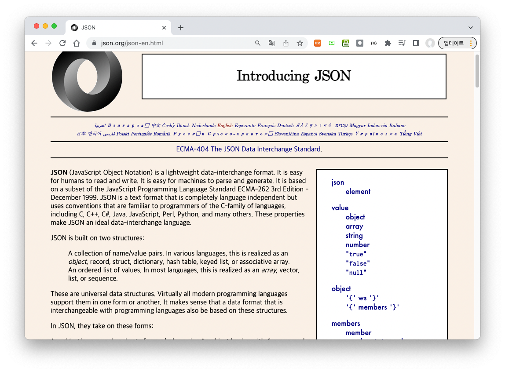
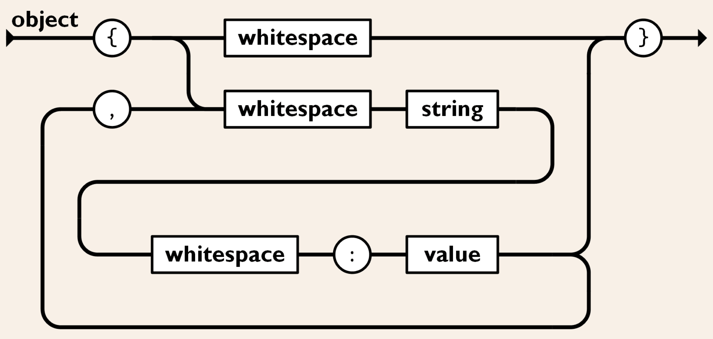
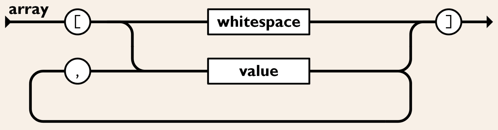
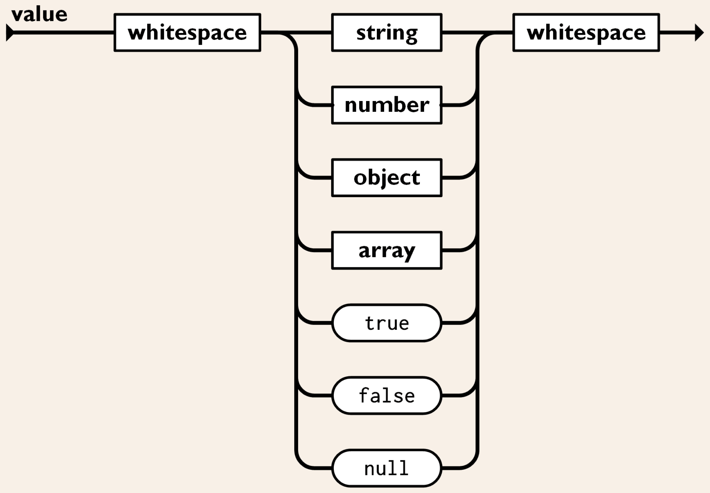
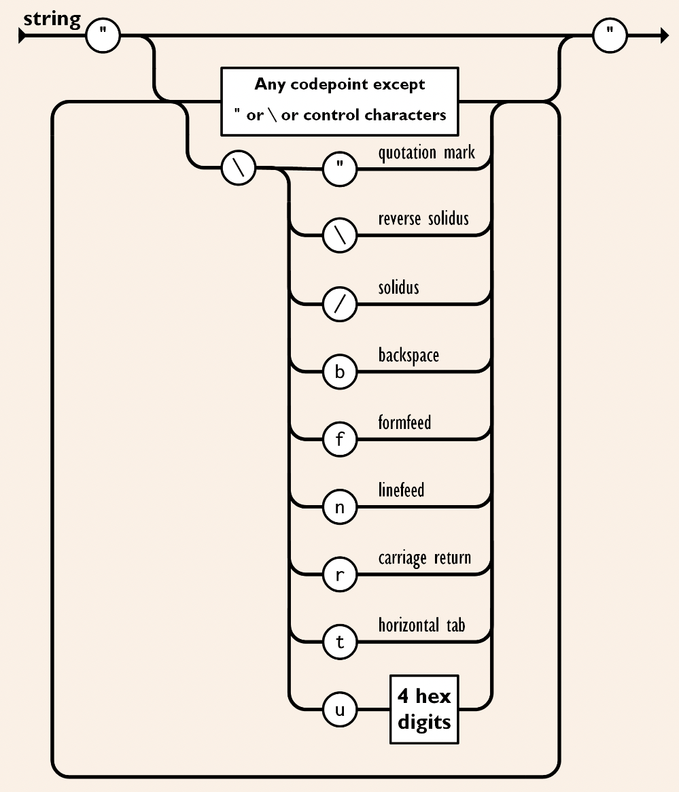
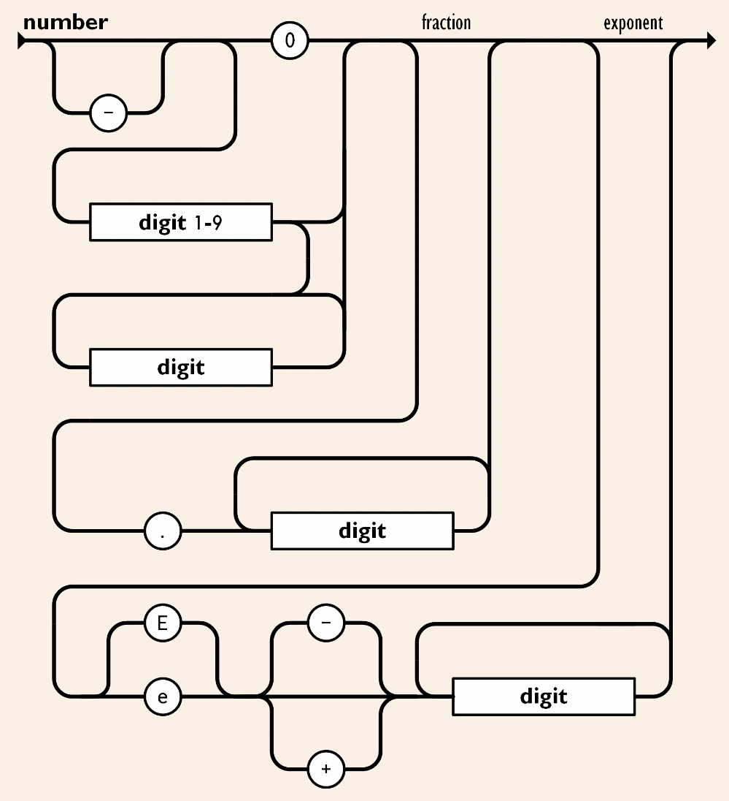
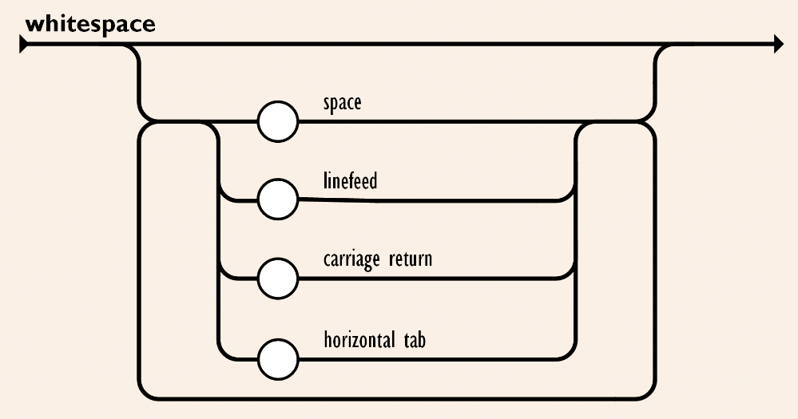

= JSON

== 개요

**JSON**footnote:[https://www.json.org/json-en.html[JSON]] (JavaScript Object Notation)은 가벼운 데이터 교환 형식으로 인간이 읽고 쓰기에 편하고, 기계가 구문 분석하고 생성하기 쉽다. 이것은 JavaScript 프로그래밍 언어 표준 ECMA-262footnote:[https://www.ecma-international.org/publications-and-standards/standards/ecma-262/[ECMA-262]] 3판(1999년 12월)의 일부분을 기반으로 한다.

JSON은 완전히 언어 독립적인 텍스트 형식이지만 C를 비롯한  C++, C#, Java, JavaScript, Perl, Python 및 기타 여러 가지 C 계열 언어의 프로그래머에게 익숙한 규칙을 사용한다. 이러한 속성은 JSON을 이상적인 데이터 교환 언어로 만든다.

JSON은 두 가지 구조를 기반으로 한다.

* name/value 쌍의 모음
** 다양한 언어에서 이것은 object , 레코드, 구조체, 사전, 해시 테이블, 키 목록 또는 연관 배열로 구현된다.
* 정렬된 값 목록
** 대부분의 언어에서 이것은 배열 , 벡터, 목록 또는 시퀀스로 구현된다.

이러한 구조는 거의 모든 최신 프로그래밍 언어에서 지원하는 보편적인 데이터 구조로서, 프로그래밍 언어와 교환할 수 있는 데이터 형식도 이러한 구조를 기반으로 한다는 것은 의미가 있다.

{empty} +

== 구성 요소

JSON 구성 요소들은 다음과 같은 형식을 취한다.

{empty} +

=== Object

* 이름/값 쌍의 정렬되지 않는 집합이다.
* **{**(왼쪽 중괄호)로 시작하여 **}**(오른쪽 중괄호)로 끝난다.
* 각 이름 뒤에 **:**(콜론) 이 오고 이름/값 쌍은 **,**(쉼표)로 구분된다.

==== 보기

* { }
* { "name" : "삼각형" }
* { "name" : "삼각형", "내각" : [ 30, 60, 90 ] }
* { "name" : "삼각형", "내각" : [ 30, 60, 90 ] , "추가" : { "색" : "파랑" }}

{empty} +

=== Array

* 정렬된 값의 모음이다
* **[**(왼쪽 대괄호)로 시작하여 **]**(오른쪽 대괄호)로 끝난다
* 값은 **,**(쉼표)로 구분 된다

==== 보기

* [1, 2, 3]
* [1, "2", 3.0]
* [1, "2", {"type" : "vlaue" } ]
* [1, [10, [100, 101]]]

{empty} +

=== Value

* **"**(큰따옴표)로 묶인 문자열
* 숫자
* true 또는 false
* null
* object
* 배열

==== 보기

* "Hello"
* 123
* 12.3
* {"name" : "nhn"}
* [1, 2, 3]
* true
* null

{empty} +

=== String

* **'\'**(백 슬래시 이스케이프)를 사용하여 **"**(큰따옴표)로 묶인 0개 이상의 유니코드 문자 시퀀스
* 문자는 단일 문자열로 표시된다
* C 또는 Java 문자열과 매우 유사하다

{empty} + 

==== 보기

* "\\\"\\\\\\/\\b\\f\\n\\r\\t"
* "\\u1234"
* "abcd"

{empty} +

=== Number

*  8진수 및 16진수 형식이 사용되지 않는다
* º이외에 C 또는 Java 숫자와 매우 유사하다

{empty} +

==== 보기

* 1234, -1234
* 123.4, -123.4
* 123.4e-1, -123.4e+1

{empty} +

=== Whitespace

* 모든 토큰 쌍 사이에 삽입 가능

